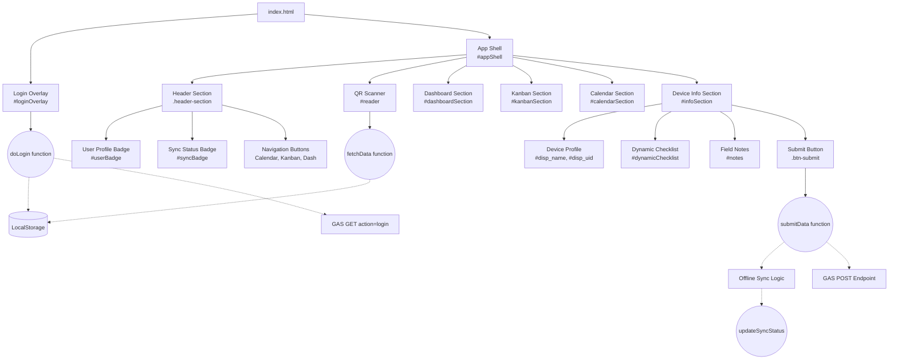

# Sơ đồ Kiến trúc UI & Chức năng (UI Architecture Map)

Tài liệu này đóng vai trò là "Bản đồ số" (Functional Map) giúp AI (Antigravity) và lập trình viên dễ dàng định vị các thành phần giao diện, chức năng và vị trí của chúng trong mã nguồn. 
**QUY TẮC:** Mọi thay đổi về giao diện hoặc chức năng mới BẮT BUỘC phải được cập nhật đồng bộ vào file này.

## 1. Sơ đồ Cấu trúc Thành phần (Mermaid Diagram)

## 2. Từ điển Mapping (UI to Code)

Để sửa chữa hoặc nâng cấp một tính năng, hãy tìm kiếm các ID/Function sau trong file `index.html`:

| Khu vực UI (Giao diện) | HTML ID / Class | JS Function liên quan | Nguồn Dữ liệu (Nơi cấp data) | Mã Vị trí (Copy to Prompt) |
| :--- | :--- | :--- | :--- | :--- |
| **Màn hình Đăng nhập** | `#loginOverlay`, `#usernameInput`, `#passwordInput` | `doLogin()` | Google Sheets (`Users`) -> `localStorage` | `[index.html#loginOverlay]` |
| **Chuyển ngôn ngữ (Login)** | `#loginLangToggle` | `setLanguage()` | Tĩnh (Static) | `[index.html#loginLangToggle]` |
| **Thanh Tiêu đề (Header)** | `.header-section` | `toggleDashboard()`, `setLanguage()` | Tĩnh (Static) | `[index.html.header-section]` |
| **Hồ sơ Nhân viên (Dropdown)** | `#userBadge`, `#userNameDisplay`, `#userRoleDisplay` | `updateUI(user)`, `doLogout()`, `setLanguage()` | `localStorage.getItem('currentUser')` | `[index.html#userBadge]` |
| **Trạng thái Đồng bộ** | `#syncBadge` | `updateSyncStatus()` | `localStorage.getItem('offline_logs')` | `[index.html:updateSyncStatus]` |
| **Camera Quét QR** | `#reader`, `#startScan` | `Html5Qrcode` library | Camera thiết bị | `[index.html#reader]` |
| **Hiển thị Thiết bị** | `#infoSection`, `#disp_name` | `fetchData(uid)` | `localStorage.getItem('localDevices')` | `[index.html:fetchData]` |
| **Mẫu Checklist** | `#dynamicChecklist` | `renderChecklist(type)` | Tĩnh (Cấu hình cứng trong mảng JS) | `[index.html:renderChecklist]` |
| **Gửi Dữ liệu (Submit)** | `.btn-submit`, `#notes` | `submitData()` | Đẩy thẳng lên GAS POST | `[index.html:submitData]` |
| **Bảng Dashboard** | `#dashboardSection`, `#assetChart`| `toggleDashboard()` | `Chart.js` (Đang là Mock Data) | `[index.html#dashboardSection]` |
| **Bảng Kanban** | `#kanbanSection` | `toggleKanban()` | (Đang là Mock Data) | `[index.html#kanbanSection]` |
| **Bảng Lịch (Calendar)** | `#calendarSection` | `toggleCalendar()` | (Đang là Mock Data) | `[index.html#calendarSection]` |

## 3. Kiến trúc Luồng Dữ liệu (Data Flow)

1. **Khởi tạo (Init)**: Khi mở WebApp, nếu có LocalStorage -> Bỏ qua Login. Nếu không -> Bật `#loginOverlay`.
2. **Đăng nhập (Auth)**: Nhập PIN -> Gửi GET request tới Apps Script -> Lấy thông tin `user` + danh sách `devices` -> Lưu vào `localStorage`.
3. **Quét Mã (Scan)**: Camera đọc được UID -> Hàm `fetchData(uid)` quét tìm uid đó trong `localStorage` thay vì gọi API -> Tốc độ phản hồi 0.01 giây.
4. **Nộp Báo cáo (Submit)**: Tick Checklist + Ghi chú -> Bấm Complete -> Gọi hàm `submitData()`. 
    - Nếu có mạng: Gửi POST tới Apps Script, cập nhật `updateSyncStatus()`.
    - Nếu mất mạng: Ghi vào `offline_logs` trong `localStorage`, đổi UI thành cảnh báo vàng. Khi có mạng (`window.addEventListener('online')`) tự động đẩy bù.
